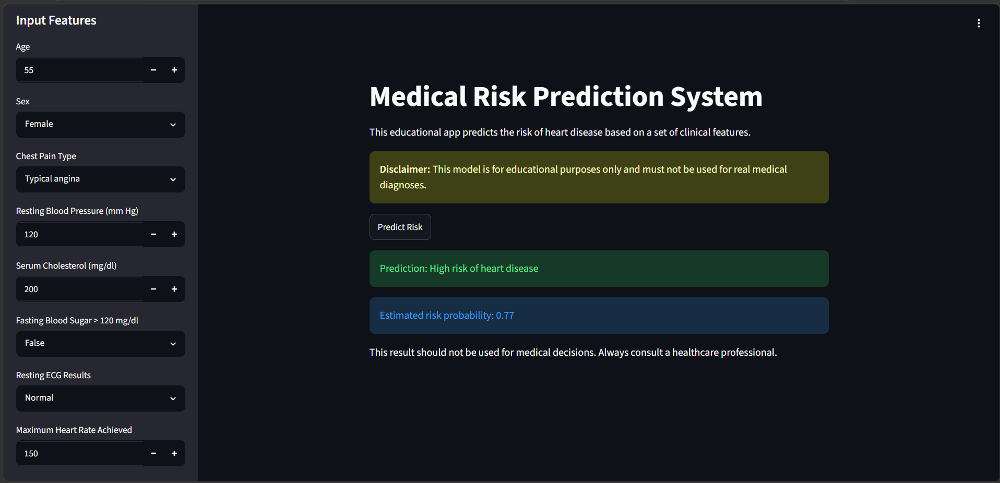

# سیستم پیش‌بینی ریسک بیماری قلبی با یادگیری ماشین

[English](README.md)

## معرفی پروژه

این مخزن شامل یک پروژه کامل و end-to-end یادگیری ماشین است که هدف آن پیش‌بینی ریسک بیماری قلبی بر اساس داده‌های بالینی رایج است.

این پروژه با Python و scikit-learn ساخته شده و مراحل مختلف یک پروژه واقعی ماشین لرنینگ را پوشش می‌دهد، از جمله:

- بارگذاری داده
- پیش‌پردازش داده
- آموزش مدل
- ارزیابی مدل
- ذخیره مدل
- انجام پیش‌بینی
- ساخت یک دمو ساده با Streamlit

این پروژه فقط برای اهداف آموزشی و پورتفولیو ساخته شده است و نباید به عنوان ابزار واقعی تشخیص پزشکی استفاده شود.

---

## بیان مسئله

بیماری‌های قلبی‌عروقی یکی از مهم‌ترین دلایل مرگ‌ومیر در جهان هستند. تشخیص زودهنگام افراد پرریسک می‌تواند به پزشکان کمک کند تا بررسی‌ها و مداخلات درمانی یا سبک زندگی را بهتر اولویت‌بندی کنند.

در این پروژه، مسئله به صورت یک مسئله طبقه‌بندی دودویی تعریف شده است:

- `0` یعنی نبود بیماری قلبی
- `1` یعنی وجود یا ریسک بالای بیماری قلبی

هدف مدل این است که با دریافت ویژگی‌های بیمار، احتمال وجود بیماری قلبی را پیش‌بینی کند.

---

## چرا این پروژه؟

این پروژه برای نمایش مهارت‌های پایه و کاربردی در علم داده و یادگیری ماشین طراحی شده است.

در این پروژه فقط یک مدل ساده آموزش داده نشده، بلکه یک pipeline کامل ساخته شده که شامل موارد زیر است:

- ساختاردهی تمیز پروژه
- ماژولار کردن کدها
- مدیریت مسیرها
- پیش‌پردازش حرفه‌ای داده
- مقایسه چند مدل مختلف
- ذخیره بهترین مدل
- ساخت گزارش و نمودار
- نوشتن تست
- ساخت اپلیکیشن Streamlit
- آماده‌سازی پروژه برای GitHub و پورتفولیو

این پروژه برای دانشجویان، افراد جونیور و کسانی که قصد ورود به مسیر AI/ML internship دارند مناسب است.

---

## دیتاست

این پروژه انتظار دارد فایل دیتاست با نام زیر در مسیر مشخص‌شده قرار بگیرد:

```text
data/raw/heart_disease.csv
```

فایل دیتاست باید یک فایل CSV شامل داده‌های مربوط به بیماری قلبی باشد و یک ستون هدف داشته باشد که وجود یا عدم وجود بیماری قلبی را نشان دهد.

کد پروژه می‌تواند نام‌های رایج ستون هدف مثل `target` یا `num` را تشخیص دهد.

نمونه ویژگی‌هایی که معمولاً در دیتاست‌های بیماری قلبی وجود دارند:

- سن بیمار
- جنسیت
- نوع درد قفسه سینه
- فشار خون در حالت استراحت
- کلسترول
- قند خون ناشتا
- نتیجه ECG
- حداکثر ضربان قلب
- آنژین ناشی از ورزش
- مقدار ST depression یا `oldpeak`
- شیب ST segment
- تعداد رگ‌های اصلی
- مقدار `thal`

> نکته مهم: این پروژه فقط برای آموزش و پورتفولیو است و نباید برای تصمیم‌گیری پزشکی واقعی استفاده شود.

---

## ساختار مورد انتظار دیتاست

فایل CSV باید در مسیر زیر قرار بگیرد:

```text
medical-risk-prediction-ml/
└── data/
    └── raw/
        └── heart_disease.csv
```

اگر فایل دیتاست وجود نداشته باشد، برنامه با خطای نامفهوم متوقف نمی‌شود؛ بلکه یک پیام واضح نمایش می‌دهد و مسیر درست قرار دادن دیتاست را اعلام می‌کند.

---

## Pipeline پروژه

روند کلی پروژه به شکل زیر است:

1. **بارگذاری داده:** خواندن فایل CSV و تشخیص ستون هدف.
2. **پیش‌پردازش داده:** مدیریت مقادیر گمشده، مقیاس‌بندی ویژگی‌های عددی و encoding ویژگی‌های دسته‌ای.
3. **آموزش مدل:** آموزش و مقایسه چند مدل کلاسیک یادگیری ماشین.
4. **ارزیابی مدل:** محاسبه معیارهایی مثل accuracy، precision، recall، F1-score و ROC-AUC.
5. **ذخیره مدل:** ذخیره بهترین مدل و متریک‌های ارزیابی در پوشه `models`.
6. **دموی Streamlit:** ساخت یک رابط کاربری ساده برای وارد کردن اطلاعات بیمار و دریافت پیش‌بینی.

---

## تکنولوژی‌های استفاده‌شده

- Python 3.10+
- pandas
- numpy
- scikit-learn
- matplotlib
- seaborn
- joblib
- Streamlit
- pytest

---

## ساختار پروژه

```text
medical-risk-prediction-ml/
├── README.md
├── README.fa.md
├── requirements.txt
├── .gitignore
├── LICENSE
│
├── app.py
├── train_model.py
├── predict.py
│
├── data/
│   ├── README.md
│   ├── raw/
│   │   └── .gitkeep
│   └── processed/
│       └── .gitkeep
│
├── src/
│   ├── __init__.py
│   ├── config.py
│   ├── data_loader.py
│   ├── preprocessing.py
│   ├── model_training.py
│   ├── evaluation.py
│   └── inference.py
│
├── models/
│   ├── .gitkeep
│   └── metrics.json
│
├── reports/
│   ├── project_report.md
│   └── figures/
│       ├── confusion_matrix.png
│       └── model_comparison.png
│
├── tests/
│   ├── conftest.py
│   ├── test_preprocessing.py
│   └── test_inference.py
│
└── assets/
    ├── .gitkeep
    └── demo_screenshot.png
```

---

## مدل‌های استفاده‌شده

در این پروژه سه مدل کلاسیک یادگیری ماشین با هم مقایسه شده‌اند:

1. **Logistic Regression**  
   یک مدل خطی مناسب برای baseline در مسائل طبقه‌بندی.

2. **Random Forest Classifier**  
   یک مدل ensemble بر پایه چندین درخت تصمیم که می‌تواند روابط غیرخطی را بهتر یاد بگیرد.

3. **Gradient Boosting Classifier**  
   یک مدل boosting که معمولاً روی داده‌های جدولی عملکرد خوبی دارد.

---

## معیارهای ارزیابی

برای ارزیابی مدل از معیارهای زیر استفاده شده است:

| معیار | توضیح |
|---|---|
| Accuracy | نسبت پیش‌بینی‌های درست به کل نمونه‌ها |
| Precision | نسبت پیش‌بینی‌های مثبت درست به کل پیش‌بینی‌های مثبت |
| Recall | نسبت نمونه‌های مثبت واقعی که درست تشخیص داده شده‌اند |
| F1-score | میانگین هماهنگ Precision و Recall |
| ROC-AUC | معیاری برای بررسی توانایی مدل در تفکیک کلاس‌ها |

در مسئله‌های مرتبط با ریسک پزشکی، معیار **Recall** اهمیت زیادی دارد؛ چون اگر بیمار پرریسک به اشتباه کم‌ریسک تشخیص داده شود، می‌تواند پیامد جدی داشته باشد.

---

## نحوه اجرای پروژه

برای اجرای پروژه روی سیستم خود، مراحل زیر را انجام دهید.

### 1. Clone کردن repository

```bash
git clone https://github.com/Erfan-Moshfeghi/medical-risk-prediction-ml.git
cd medical-risk-prediction-ml
```

### 2. ساخت و فعال‌سازی محیط مجازی

در ویندوز:

```bash
python -m venv .venv
.venv\Scripts\activate
```

در macOS یا Linux:

```bash
python -m venv .venv
source .venv/bin/activate
```

### 3. نصب وابستگی‌ها

```bash
pip install -r requirements.txt
```

### 4. آماده‌سازی دیتاست

فایل دیتاست را با نام زیر در این مسیر قرار دهید:

```text
data/raw/heart_disease.csv
```

### 5. آموزش مدل

```bash
python train_model.py
```

بعد از اجرای موفق، فایل‌های خروجی در مسیرهای زیر ساخته می‌شوند:

```text
models/metrics.json
reports/figures/confusion_matrix.png
reports/figures/model_comparison.png
```

### 6. اجرای پیش‌بینی ساده از طریق ترمینال

```bash
python predict.py
```

### 7. اجرای اپلیکیشن Streamlit

```bash
streamlit run app.py
```

### 8. اجرای تست‌ها

```bash
pytest
```

---

## نتایج مدل

بعد از آموزش مدل روی دیتاست بیماری قلبی، بهترین مدل به نتایج زیر روی validation set رسید:

| معیار | مقدار |
|---|---:|
| Accuracy | 0.8361 |
| Precision | 0.7805 |
| Recall | 0.9697 |
| F1-score | 0.8649 |
| ROC-AUC | 0.9091 |

مقدار بالای Recall در این پروژه مهم است، چون نشان می‌دهد مدل توانسته بیشتر نمونه‌های پرریسک را تشخیص دهد.

> توجه: این مدل برای استفاده پزشکی واقعی معتبر نیست و فقط برای اهداف آموزشی و پورتفولیو ساخته شده است.

---

## دمو

این پروژه شامل یک اپلیکیشن ساده Streamlit است که کاربر می‌تواند اطلاعات بیمار را وارد کند و نتیجه پیش‌بینی ریسک بیماری قلبی را ببیند.

برای اجرای دمو:

```bash
streamlit run app.py
```

نمونه تصویر دمو:



---

## توضیح پروژه در مصاحبه

در مصاحبه کارآموزی یا جلسه معرفی پروژه می‌توان این پروژه را این‌طور توضیح داد:

> این پروژه یک سیستم end-to-end یادگیری ماشین برای پیش‌بینی ریسک بیماری قلبی از روی داده‌های جدولی بالینی است. در این پروژه داده‌ها را بارگذاری و پیش‌پردازش کردم، چند مدل مختلف را آموزش دادم، مدل‌ها را با معیارهایی مثل F1-score و ROC-AUC مقایسه کردم، بهترین مدل را ذخیره کردم و در نهایت یک اپلیکیشن Streamlit برای نمایش عملکرد مدل ساختم. همچنین برای اطمینان از پایداری بخش‌هایی از پروژه، تست‌های ساده با pytest نوشتم.

---

## محدودیت‌ها

این پروژه فقط برای اهداف آموزشی است.

محدودیت‌های اصلی پروژه:

- دیتاست ممکن است کوچک یا قدیمی باشد.
- مدل روی داده‌های واقعی بیمارستانی اعتبارسنجی نشده است.
- مدل برای تصمیم‌گیری پزشکی واقعی مناسب نیست.
- تنظیم دقیق hyperparameterها به صورت عمیق انجام نشده است.
- برای استفاده واقعی، به داده بیشتر، اعتبارسنجی دقیق، توضیح‌پذیری مدل و بررسی‌های تخصصی پزشکی نیاز است.

---

## بهبودهای آینده

چند ایده برای توسعه آینده پروژه:

- اضافه کردن hyperparameter tuning
- بررسی class imbalance
- اضافه کردن SHAP برای توضیح‌پذیری مدل
- ساخت API با FastAPI
- بهبود رابط کاربری Streamlit
- اضافه کردن CI/CD با GitHub Actions
- افزودن notebook تحلیلی برای EDA

---

## نویسنده

**Erfan Moshfeghi**

GitHub: [Erfan-Moshfeghi](https://github.com/Erfan-Moshfeghi)

---

## هشدار پزشکی

این پروژه یک ابزار آموزشی است و نباید برای تشخیص، درمان یا تصمیم‌گیری پزشکی واقعی استفاده شود.